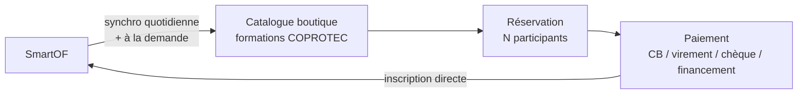
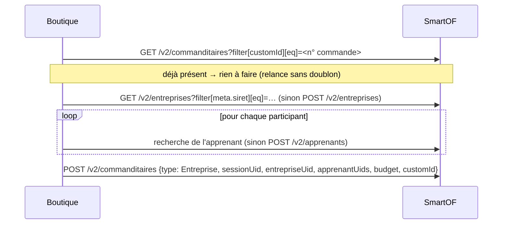
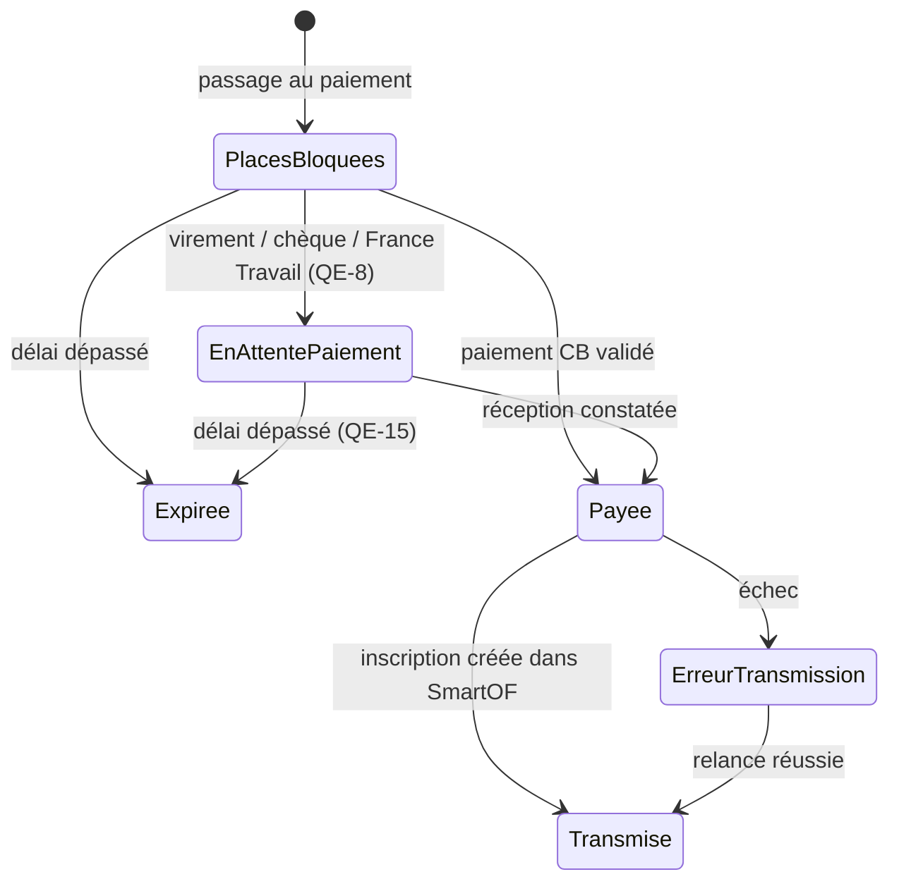

# Cahier des charges — Refonte "Boutique" COPROTEC (MVP)

> Statut (2026-09-29) : cadrage technique v1 bouclé, doc API SmartOF v2 étudiée, lot 1 (socle) réalisé. Les points encore ouverts sont des questions aux équipes (**QE-n**) et à l'éditeur SmartOF (**QSO-n**), regroupées dans [`QUESTIONS_EQUIPES.md`](QUESTIONS_EQUIPES.md). Ce cahier y renvoie par leur numéro.

## 1. Contexte

Le système de réservation de formations ("boutique") de COPROTEC existe aujourd'hui en trois variantes :

| Dossier | Description | Statut |
|---|---|---|
| `../boutique-old` | Version historique en PHP procédural/MVC maison, sans framework ni ORM | Legacy, en production, sert de référence métier. Dépôt Git renommé `boutique-old` |
| `../boutique-sf/boutique` | Refonte Symfony 7 + Vue 3 + Doctrine ORM | Jugée trop évoluée / complexe pour les besoins actuels |
| `boutique` (ce dossier) | Nouvelle refonte, MVP sobre | En cours de cadrage |

L'objectif est de repartir sur une base **technique volontairement plus simple**, en reprenant sélectivement la logique métier de `boutique-old` et la structure Symfony/Vue de `boutique-sf`, sans hériter de leur complexité.

**Changement majeur : l'ERP Navision (NAV / wsformation) est abandonné**, remplacé par **SmartOF**, qui regroupe les formations, les sessions, les inscriptions et les données clients. SmartOF contient aussi des formations **d'autres organismes**, réservées par d'autres canaux : la boutique ne doit afficher et vendre **que les formations COPROTEC** (cf. §5.2).

## 2. Objectifs du projet

- **But de la v1 : afficher les formations COPROTEC proposées et permettre de les réserver et de les payer.** Le reste (gestion des sessions, suivi des inscriptions, facturation) vit dans SmartOF.
- Garder une base de code simple à maintenir et à faire évoluer (peu d'abstractions, pas de dépendances superflues).
- Remplacer l'intégration Navision/wsformation par l'API SmartOF v2.
- Isoler ce projet dans son propre dépôt Git, indépendant de `boutique-old` et `boutique-sf`.

## 3. Hors périmètre

- `boutique-old` et `boutique-sf` restent en l'état, non modifiés par ce projet.
- Aucune fonctionnalité de `boutique-sf` n'est reprise par défaut : chaque brique est réévaluée à l'aune du besoin MVP.
- Hors v1 : compte client connecté, codes promo, back-office, facturation (gérée par SmartOF), regroupement avancé du catalogue par provenance.

## 4. Stack technique retenue

| Composant | Choix | Notes |
|---|---|---|
| Langage backend | PHP 8.2+ | |
| Framework | Symfony 7.x | |
| Accès données | Doctrine ORM | |
| Frontend interactif | Vue.js 3 | Composants ciblés montés sur des templates Twig, pas de SPA |
| Build assets | Webpack Encore | Organisation de `/coplanif` : entrée `vue` unique (`assets/vue/vue.js`, registre des composants), composants rangés par domaine. Différence voulue : chaque composant est monté sur son propre élément (`data-vue`), pas de `
` global compilé dans le navigateur, pour éviter l’injection de template sur un site public |
| Base de données | MySQL | Copie locale du catalogue SmartOF + commandes de la boutique |
| Environnement dev | Docker | Conteneur app (php-apache) exposé en local + MySQL |
| Serveur web | Nginx sur l’hôte (reverse proxy, HTTPS) + Apache dans le conteneur (image `php:8.x-apache`) | Même organisation que `coplanif` |
| Tâches planifiées | Commandes Symfony (cron) | Synchro catalogue, expiration des blocages de places, relances d'envoi SmartOF |

## 5. Fonctionnalités

### 5.1 Rôle de la boutique

La boutique est une **vitrine + tunnel de paiement**. Une réservation payée devient directement une inscription dans SmartOF, **sans étape de validation** par le service formation (à confirmer : QE-1). La facturation est entièrement gérée par SmartOF : la boutique ne crée ni facture ni avoir.

### 5.2 Catalogue

- **Source :** copie locale des formations (produits) et sessions SmartOF, synchronisée **chaque jour tôt le matin**, plus un **déclenchement à la demande** : commande console relançable à tout moment, et notification envoyée par SmartOF si l'éditeur le permet (QSO-2).
- **Formations COPROTEC uniquement.** SmartOF regroupe aussi les formations d'autres organismes, qui ne doivent être ni affichées ni réservables. Le moyen de les distinguer reste à arrêter (QE-4, QSO-3). Options, par ordre de préférence :
  1. **Champ personnalisé sur le produit** (ex. « Vendu sur la boutique COPROTEC » : Oui/Non, ou « Organisme »), renseigné par le service formation. Les champs personnalisés des produits sont filtrables par l'API (`filter[custom_fields.custom_field_N][eq]=…`), donc la synchro ne ramène que les bonnes formations.
  2. Un mécanisme natif de SmartOF (organisme, publication au catalogue en ligne), s'il existe et s'il est exposé par l'API (QSO-3).
  3. Une convention sur la référence (`customId`, filtrable en « contient ») ou sur les compétences : c'est fragile, car cela repose sur une saisie manuelle sans contrôle.

  Le filtre s'applique à la synchro **et** au moment de réserver : la boutique refuse toute réservation sur une session dont le produit n'est pas dans son catalogue.
- **Sessions affichées :** uniquement les sessions ouvertes à l'inscription (`GET /v2/sessions_ouvertes`), dans le futur. Les sessions passées disparaissent d'office. Date limite de réservation avant le début de la session : QE-6.
- **Cycle de vie :** le service formation crée, annule ou remplace les sessions dans SmartOF, et la synchro reflète ces changements. La conduite à tenir pour une session annulée qui a déjà des réservations payées est une question métier (QE-5).
- **Contenu :** fiches simples en v1 (intitulé, dates, lieu, durée, prix, places restantes), car le détail est déjà sur le site vitrine. Le regroupement par provenance ou par thème viendra dans un lot ultérieur.

### 5.3 Réservation

- **Une réservation = une session, 1 à N participants, un seul paiement regroupé.** Exemple : une société inscrit 4 salariés à la même session et paie une seule fois pour les 4. Le formulaire affiche un bloc de champs par participant. Nombre maximum de participants : QE-3.
- **Réservation en invité** (pas de compte), comme `boutique-old`. Particuliers : QE-2 (l'ancienne boutique imposait société et SIRET).
- **Champs repris de `boutique-old`, mieux structurés et validés champ par champ :**
  - Contact : prénom, nom, email (avec confirmation), téléphone.
  - Société : raison sociale, adresse, code postal, ville, SIRET, APE, TVA intracommunautaire, nombre de salariés, OPCO, organisation professionnelle, dirigeant (prénom, nom), téléphone et email de la société, remarque.
  - Listes reprises de `boutique-old` (validité à confirmer : QE-29) : organisation professionnelle (Non-adhérent, CAPEB, FFB, SYNASAV…, sans effet sur le prix dans l'ancienne boutique) ; situation du participant (Salarié, Gérant non salarié, Demandeur d'emploi).
  - Par participant : prénom, nom, date de naissance, situation, **n° de sécurité sociale obligatoire** (passeport prévention, format `^[12][0-9]{4}([0-9]{2}|2A|2B)[0-9]{8}$`). Sans ce numéro, pas d'inscription en ligne : le message renvoie vers le service formation (règle de `boutique-old`).
- **Financements (repris de `boutique-old`) :**
  - Sans financement : paiement par CB, virement ou chèque.
  - France Travail (ex-Pôle emploi) : identifiant demandeur d'emploi obligatoire (format de `boutique-old`), mode de paiement « financement ».
  - CPF : proposé seulement pour certaines formations. Il redirige vers moncompteformation.gouv.fr, sans réservation dans la boutique. Dans `boutique-old`, la seule formation concernée était codée en dur (`T68-25`). Ici, l'éligibilité doit venir de SmartOF, par exemple une case « Éligible CPF » sur le produit (QE-28).
  - Financement en plusieurs parties (tiers + reste à charge) : QE-13.
- **Prix :** repris de SmartOF (`presetTarification` du produit, HT + TVA). Un produit peut avoir plusieurs tarifs : le tarif à appliquer reste à arrêter (QE-10, QSO-4). Total = prix unitaire × nombre de participants. Affichage HT/TTC et frais annexes : QE-11, QE-12.

### 5.4 Places et blocage

Une place n'est prise que par une réservation **payée** (ou engagée, pour le virement et le chèque : QE-8). Il n'y a pas de demande en attente de validation.

- **Places disponibles** = limite SmartOF − inscrits SmartOF − places bloquées ou payées dans la boutique mais pas encore transmises.
- **Blocage temporaire :** au passage au paiement, la boutique bloque les N places pendant un délai limité (proposition : 30 min, QE-7). Sans paiement dans ce délai, les places sont libérées.
- **Réservations simultanées :** le calcul et le blocage se font sous verrou en base, sur la session. Exemple : il reste 6 places et deux réservations de 4 arrivent en même temps. La première bloque ses 4 places ; la seconde est arrêtée **avant paiement** avec un message clair (« il ne reste que 2 places »), et le client peut réduire son nombre de participants.
- **Contrôle en direct :** les places restantes sont revérifiées auprès de SmartOF (`GET /v2/sessions_ouvertes`) juste avant le paiement, pour tenir compte des inscriptions faites directement dans SmartOF.
- **Surréservation résiduelle :** un paiement reste possible sur une session remplie entre-temps par un autre canal. La boutique la détecte à l'envoi et alerte le service formation ; la conduite à tenir est définie en QE-9.

### 5.5 Paiement

- **Paiement au moment de la réservation**, comme `boutique-old`.
- **CB : Monetico**, repris et amélioré depuis `boutique-old` (POST signé HMAC-SHA1 vers `p.monetico-services.com`, cf. `../boutique-old/view/reservation/etape3.inc.php`). Un environnement de test Monetico reste utilisable en permanence en préprod.
  - Le paiement n'est considéré comme validé qu'à réception de la **notification serveur à serveur de Monetico** (URL de retour « CGI2 », signature vérifiée). Le retour du navigateur du client sert seulement à l'affichage : il ne suffit pas à valider.
  - Référence de commande unique, envoyée à Monetico et reprise dans SmartOF (`customId`). Format proposé : `BTQ-AAAAMMJJ-NNNN`.
- **Virement, chèque, financement tiers :** conservés dès le MVP. Suivi de la réception et délai de paiement : QE-14, QE-15.
- **Factures :** émises par SmartOF, rien à faire dans la boutique. La boutique transmet seulement l'information de paiement à SmartOF (QSO-7).
- **Annulation, remboursement, rétractation :** gérés par la comptabilité (avoirs ou remboursements directs). Règles et options pour décharger la compta : QE-16 à QE-18.

### 5.6 Communications

- Répartition entre les envois automatiques de SmartOF et ceux de la boutique : QE-19 à QE-22.
- Au minimum, la boutique envoie un **récapitulatif de commande** au client (avec les coordonnées de paiement pour un virement ou un chèque) et une **alerte technique** en cas d'échec d'envoi à SmartOF.

### 5.7 Écrans

| Écran | Contenu |
|---|---|
| Catalogue | Liste des sessions ouvertes des formations COPROTEC : intitulé, dates, lieu, prix, places restantes. Filtres simples (formation, ville, mois). |
| Fiche formation | Adresse stable par formation, pour les liens depuis le site vitrine (QE-31). Sessions à venir, infos essentielles, lien vers la fiche détaillée du site vitrine (QE-30). |
| Réservation — étape 1 | Nombre de participants, contact, société, participants, financement. Validation champ par champ. |
| Réservation — étape 2 | Mode de paiement, récapitulatif, acceptation des CGV. Les places sont bloquées à ce moment-là. |
| Paiement CB | Redirection vers Monetico, puis retour succès ou échec. |
| Confirmation | Récapitulatif, n° de commande, instructions pour le virement ou le chèque. |
| Pages légales | Mentions légales, CGV, politique de confidentialité (QE-27). |
| Erreurs | Session complète ou fermée, formation introuvable, erreur de paiement. |

Une seule langue (français). Le site doit s'afficher correctement sur mobile.

### 5.8 Hors v1

Compte client et connexion (y compris via SmartOF, non faisable par l'API aujourd'hui : QSO-11), codes promo, back-office, regroupement avancé du catalogue.

## 6. Intégration SmartOF (API v2)

Doc : [developers.smartof.fr](https://developers.smartof.fr), étudiée le 2026-09-25.

### 6.1 Accès et conventions

- **Auth :** clé d'intégration `smk_…` en `Authorization: Bearer`, créée par l'admin SmartOF (le porteur du projet) dans Paramètres → Intégrations → API REST v2. Elle est stockée comme secret (variable d'environnement), jamais dans le dépôt.
- **URL de base propre à l'instance** (`https://europe-west3-<instance>.cloudfunctions.net/external/api`), chemins `/v2/…`. Une **instance de test dédiée** sert au dev et à la préprod (QSO-1) : la préprod ne touche jamais le SmartOF de production.
- Max 4 requêtes concurrentes, pagination par curseur (≤ 1000 éléments).
- Schémas stricts : une clé inconnue donne une erreur 400, « non renseigné » s'écrit `""` (jamais `null`), les dates sont en ISO 8601 avec l'offset Europe/Paris et les dates de naissance en `YYYY-MM-DD`.

### 6.2 Lecture du catalogue

| Donnée | Endpoint | Usage |
|---|---|---|
| Formations | `GET /v2/produit_formations` | Synchro filtrée sur le critère COPROTEC (§5.2), en delta sur `updatedAt`. Les produits `archived` sont retirés. |
| Sessions | `GET /v2/session_formations` | Dates, lieu, statut, produit lié (`produitInstance.produitFormationUid`). |
| Sessions ouvertes et places | `GET /v2/sessions_ouvertes` | Liste des sessions réservables et remplissage (`inscrits`, `limite`). Endpoint non paginé, appelé aussi en direct avant chaque paiement. |
| Tarifs | `produit_formations.presetTarification.tarifs[].budget[]` | `prixUnitaireHT`, `tva`. |
| Champs personnalisés | `GET /v2/settings/custom_fields` | Configuration (types, options) servant à valider nos valeurs avant envoi. |

### 6.3 Envoi d'une réservation payée : inscription directe

Il n'y a pas de validation d'inscription : la boutique crée directement l'inscription. Elle n'utilise donc **pas** les « demandes d'inscription » (`/v2/demandes_inscription`), qui supposent une validation manuelle par l'organisme.

- `customId` du commanditaire = **n° de commande de la boutique**. Il sert de référence commune et permet de relancer un envoi sans créer de doublon.
- Doublons : les entreprises sont retrouvées par SIRET et les apprenants par nom, prénom et date de naissance (les participants n'ont pas d'email dans `boutique-old`). La clé de rapprochement recommandée par SmartOF reste à confirmer (QSO-12).
- **Données sans champ natif dans SmartOF** (n° de sécu, mode de financement, identifiant France Travail, mode et référence du paiement, statut BPF…) : elles passent par des **champs personnalisés** (20 par entité : apprenant, entreprise, commanditaire). Le porteur du projet les crée dans SmartOF ; la liste est à valider avec les équipes (QE-23).
- **Échec d'envoi** (API indisponible, donnée refusée, session pleine) : la commande reste en file dans la boutique avec des relances automatiques. Au-delà de N échecs, un email d'alerte part.
- `POST /v2/commanditaires/{uid}/apprenants`, envisagé au départ, ne sert qu'à rattacher des apprenants **existants** à un commanditaire Entreprise existant. Il n'est pas utilisé.

### 6.4 Limites connues de l'API

- Pas d'enregistrement de paiement : les factures sont en lecture seule (QSO-7).
- Pas de webhook : d'où la synchro planifiée et la question QSO-2.
- Pas d'authentification apprenant (QSO-11).

## 7. Modèle de données (esquisse)

| Entité | Rôle | Origine |
|---|---|---|
| `Formation` | Produit SmartOF COPROTEC (intitulé, durée, tarifs) | Synchro |
| `Session` | Session d'une formation (dates, lieu, limite de places) | Synchro |
| `Commande` | Réservation : session, contact, société, financement, total, mode de paiement, statut, n° de commande | Boutique |
| `Participant` | Personne inscrite dans une commande | Boutique |
| `Paiement` | Transaction (Monetico ou hors ligne), référence, montant | Boutique |

Statuts d'une commande :

Les données sensibles (n° de sécu) sont conservées le moins longtemps possible après la transmission (QE-26).

## 8. Migration des données

- Source : dump de structure `../boutique-old/doc/db/boutique.sql` (tables `code_promo`, `evenements`, `mails_envoyes`, `paiements`, `participants`, `reservations`, `villes`). **Cette structure n'est pas à reprendre** : elle sert seulement à extraire les données utiles, converties vers le schéma Doctrine ci-dessus.
- Même principe pour les données SmartOF : leur format ne dicte pas le schéma cible.
- Besoin réel d'historique à confirmer (QE-25). Comme les inscriptions vivent désormais dans SmartOF, il est peut-être limité aux paiements, voire nul.

## 9. Exigences non fonctionnelles

- **Sécurité :**
  - HTTPS partout, protection CSRF sur les formulaires, validation côté serveur de chaque champ (la validation côté navigateur n'est qu'un confort).
  - Limitation du nombre de soumissions par adresse IP (Symfony RateLimiter) contre les robots.
  - Secrets (clé SmartOF, clé Monetico, accès email, base de données) dans des variables d'environnement, jamais dans le dépôt.
- **Données sensibles :** le n° de sécurité sociale est chiffré en base (chiffrement applicatif, libsodium) et effacé après la transmission à SmartOF, selon QE-26. Il n'apparaît jamais dans les logs ni dans les emails.
- **RGPD :** mentions d'information sur le formulaire, durées de conservation (QE-26), purge automatique des commandes anciennes. Un bandeau cookies n'est nécessaire que si un outil de mesure d'audience est ajouté (QE-36).
- **Accessibilité et compatibilité :** formulaires accessibles (libellés, messages d'erreur liés aux champs, navigation au clavier), affichage mobile, navigateurs récents (Chrome, Edge, Firefox, Safari).
- **Fuseau horaire :** Europe/Paris partout (serveur, base, dates envoyées à SmartOF).
- **Supervision :**
  - Logs applicatifs (Monolog), avec une alerte email en cas d'échec d'envoi SmartOF, d'échec de synchro ou de surréservation.
  - Journal des appels SmartOF et des notifications Monetico, sans données sensibles.
- **Sauvegardes :** sauvegarde quotidienne de la base de prod. Le catalogue peut être reconstruit depuis SmartOF ; seules les commandes sont précieuses.
- **Emails :** envoi par Brevo (déjà utilisé par `boutique-old`) via Symfony Mailer. Une adresse d'expédition dédiée reste à définir.

## 10. Environnements et déploiement

Même organisation que `/coplanif`, qui tourne déjà en préprod et en prod :

| Environnement | Hébergement | SmartOF | Monetico |
|---|---|---|---|
| dev | Docker local (app php-apache + MySQL 8) | Instance de test (QSO-1) | Mode test |
| préprod (`preprod.app.coprotec.net`) | VPS de `coplanif`, `docker-compose.preprod.yml`, conteneur Apache derrière le Nginx de l’hôte (vhost + certificat Let’s Encrypt), dossier `/srv/preprod.app.coprotec.net` | Instance de test | Mode test (`p.monetico-services.com/test/`) |
| prod (même domaine que `boutique-old`) | VPS de `coplanif`, `docker-compose.prod.yml` | Production | Production |

- Déploiement par un script `deploy.sh <preprod|prod>` (build, migrations, cache), déclenchable par GitHub Actions via SSH, comme `coplanif`.
- Tâches planifiées (cron du conteneur ou du VPS) :
  - synchro du catalogue chaque matin ;
  - libération des places bloquées expirées (toutes les minutes) ;
  - relance des envois SmartOF en échec ;
  - purge RGPD.
- La préprod doit être accessible à Monetico (URL de notification publique en HTTPS) mais pas au public : protection par mot de passe (authentification HTTP) sauf sur l'URL de notification Monetico.

## 11. Prérequis techniques

| Élément | Statut | Détenteur |
|---|---|---|
| Doc API SmartOF v2 | Disponible | — |
| Clé API + instance SmartOF de test | À obtenir (QSO-1) | Porteur du projet / éditeur SmartOF |
| Champs personnalisés SmartOF (produit, apprenant, entreprise, commanditaire) | À créer après QE-4, QE-23, QE-28 | Porteur du projet |
| Identifiants Monetico de test et de prod (TPE, clé, code société) | Décidé : ceux de `boutique-old` (même TPE). Nouvelle URL de notification à déclarer chez Monetico ; valeurs à fournir dans `.env.local` (non versionné) | Porteur du projet / banque |
| Compte Brevo (clé API, expéditeur) | Décidé : celui de `boutique-old` ; valeurs dans `.env.local` | Porteur du projet |
| Noms de domaine préprod et prod, certificats HTTPS | Décidé : préprod `preprod.app.coprotec.net`, prod = domaine actuel de `boutique-old` (bascule à la mise en ligne). DNS et certificat préprod à créer | Porteur du projet |
| Serveur (VPS) préprod/prod | Décidé : VPS de `coplanif` | Porteur du projet |
| Dépôt GitHub privé `boutique` + accès SSH pour le déploiement | À créer | Porteur du projet |
| Charte graphique (logo HD, couleurs, typographies) | Par défaut, celle de `boutique-old` : Bootstrap, Open Sans, bleu `#0071C2`, logo `assets/images/logo.png`. Alignement éventuel sur le site vitrine : QE-32 | Communication |
| Textes (CGV, mentions légales, emails, confirmation) | À fournir (QE-27, QE-33). Ceux de `boutique-old` servent de base provisoire. | Équipes |

## 12. Livrables

- Dépôt Git dédié (privé), préparé en local ; dépôt GitHub distant à créer le moment venu.
- Environnement Docker de dev (app php-apache + MySQL) ; vhost Nginx de l’hôte fourni pour la préprod et la prod.
- Environnements préprod (Monetico en mode test + instance SmartOF de test) et prod, avec `deploy.sh`.
- Documentation : ce cahier des charges, [`QUESTIONS_EQUIPES.md`](QUESTIONS_EQUIPES.md), `CLAUDE.md`.

## 13. Décisions actées

- [x] Nom du dépôt : `boutique` (nouveau) ; l'ancien est renommé `boutique-old` ; les deux sont privés.
- [x] Stack : Symfony 7.4 + Vue 3 (composants ciblés via Webpack Encore, pattern `/coplanif`) + Doctrine ORM + MySQL ; Nginx en reverse proxy sur l’hôte, Apache dans le conteneur ; environnements dev Docker, préprod, prod.
- [x] Hébergement : VPS de `coplanif` ; préprod `preprod.app.coprotec.net` (accès restreint par auth basique + IP, sauf l’URL de notification Monetico) ; prod sur le domaine actuel de `boutique-old`.
- [x] Monetico et Brevo : accès de `boutique-old` réutilisés.
- [x] ERP : Navision abandonné, remplacé par **SmartOF** (API v2).
- [x] But v1 : afficher et rendre réservables et payables **les seules formations COPROTEC** présentes dans SmartOF.
- [x] Catalogue : copie locale synchronisée chaque matin tôt + déclenchement à la demande ; places revérifiées en direct avant paiement.
- [x] Inscription : **directe, sans validation** (à confirmer par QE-1), via entreprises, apprenants et commanditaires ; `customId` = n° de commande.
- [x] Réservation groupée : N participants pour une session, un seul paiement.
- [x] Places : prises par les réservations payées (pas de demandes en attente), blocage temporaire pendant le paiement, verrou contre les réservations simultanées.
- [x] Paiement au moment de la réservation (comme `boutique-old`) : Monetico CB + virement, chèque, financement tiers.
- [x] Financements et champs du formulaire repris de `boutique-old`, avec validation stricte par champ.
- [x] Facturation : entièrement dans SmartOF ; remboursements et avoirs : comptabilité.
- [x] Pas de code promo, pas de back-office, réservation en invité en v1.
- [x] Instance SmartOF de test dédiée pour dev et préprod (à obtenir : QSO-1).
- [x] Échec d'envoi à SmartOF : file de relances automatiques + email d'alerte.
- [x] Administration SmartOF (clé API, champs personnalisés) : porteur du projet (DSI).

## 14. Plan de réalisation

Construction de l'application complète, lot par lot, jusqu'à une préprod testable. Tant qu'une QE ou une QSO n'a pas de réponse, le code utilise une **valeur par défaut provisoire**, isolée en configuration et signalée par un commentaire `// PROVISOIRE (QE-n)`.

| Lot | Contenu | Dépend de |
|---|---|---|
| 1. Socle | Squelette Symfony 7.4, Docker dev (php-apache + MySQL), Encore + Vue 3, gabarit de page (charte `boutique-old`) | — |
| 2. Catalogue | Entités `Formation` / `Session`, client API SmartOF, commande de synchro (filtre COPROTEC configurable), SmartOF simulé en dev, pages catalogue et fiche | QE-4, QSO-1, QSO-3 (valeurs provisoires en attendant) |
| 3. Réservation | Formulaire (participants dynamiques en Vue), validations, `Commande` / `Participant`, blocage des places avec verrou, expiration | QE-3, QE-7, QE-8 |
| 4. Paiement | Monetico (aller + notification serveur), virement / chèque / France Travail, emails via Brevo | Accès Monetico de test |
| 5. Envoi SmartOF | Entreprise, apprenants, commanditaire ; file de relances ; alertes | QE-23, QSO-5, QSO-12 |
| 6. Préprod | `docker-compose.preprod.yml`, `deploy.sh`, cron, vhost Nginx de l'hôte, GitHub Actions | Dépôt GitHub, DNS `preprod.app.coprotec.net` |
| 7. Recette | Parcours complets en préprod avec les équipes | QE-35 |

## 15. Points ouverts

Voir [`QUESTIONS_EQUIPES.md`](QUESTIONS_EQUIPES.md) et les prérequis techniques du §11. Questions bloquantes pour le développement :

- **QE-4 / QSO-3** : critère d'identification des formations COPROTEC, qui conditionne la synchro du catalogue.
- **QE-10 / QSO-4 / QSO-13** : tarif à appliquer et limite de places qui fait foi, qui conditionnent le calcul du prix et des places.
- **QE-7, QE-8** : délai de blocage des places, et blocage ou non pour le virement, le chèque et le financement France Travail.
- **QE-23** : liste des champs personnalisés à créer dans SmartOF, qui conditionne l'envoi des inscriptions.
- **QSO-1** : instance de test, qui conditionne les tests d'intégration.

Ces questions bloquent chacune une partie précise, pas le démarrage : le squelette, Docker, le tunnel de réservation et Monetico en mode test peuvent avancer sans elles.
